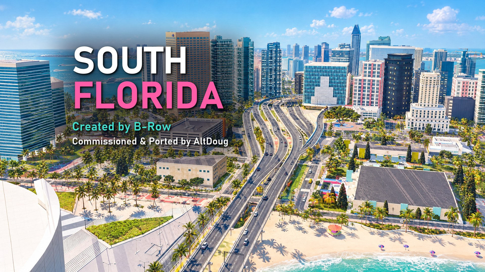
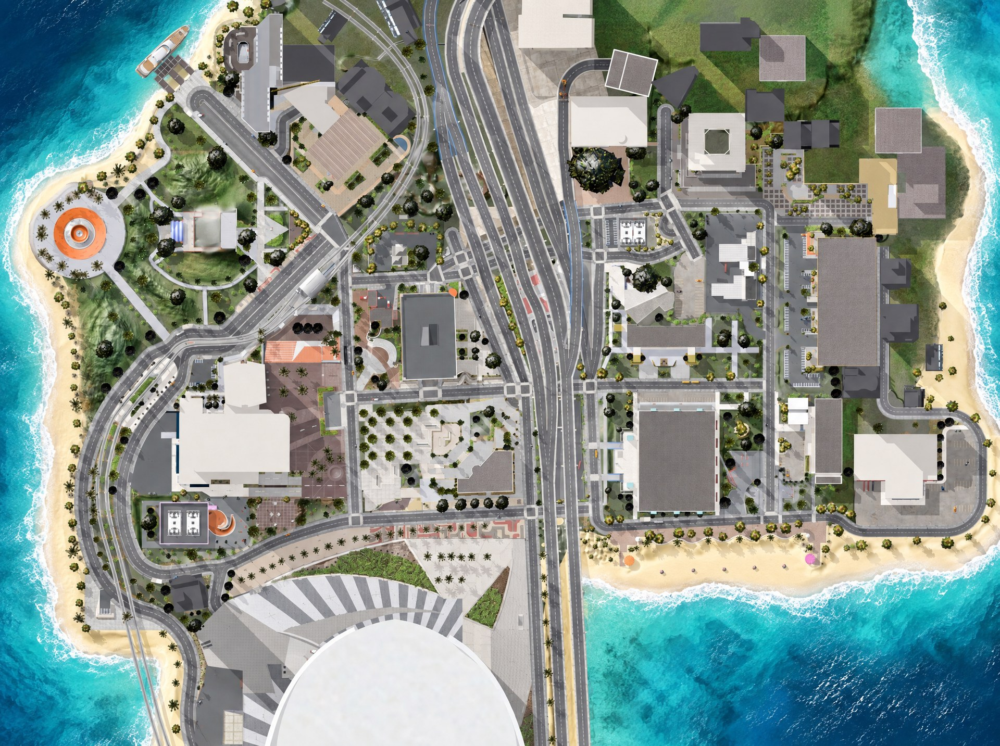

# South Florida for skate. (ReSkate)

**South Florida**, the Skater XL street map created by B-Row, commissioned and ported to skate. by AltDoug
through [ReSkate](https://github.com/Dingo-Shenanigans/ReSkate).

Download it from Thunderstore (community `reskate`). This repository only holds the pictures and notes for
the release page.

## Credits
- Created by B-Row for Skater XL ([mod.io](https://mod.io/g/skaterxl/m/south-florida-by-b-row-580)).
- Commissioned and ported to skate. by AltDoug, who owns the map.
- ReSkate and ReSkate Studio by Dingo-Shenanigans and the ReSkate team.
- Spotbuilder by zeex64, used to convert the map.
- Cover and map art generated with Higgsfield AI (GPT Image 2.5) from renders of the map.
- Port built with Claude Code (Anthropic), directed and tested by a human.

The images in this repository are not licensed for reuse.
